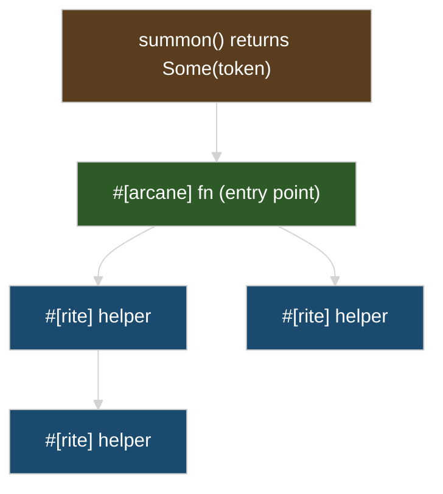

# The #[arcane] Macro

`#[arcane]` creates a safe wrapper around SIMD code. Use it at **entry points**—functions called from non-SIMD code (after `summon()`, from tests, public APIs).

For internal helpers called from other SIMD functions, use [`#[rite]`](./rite.md) instead—it has zero wrapper overhead.

## How It Works




`#[arcane]` sits at the boundary between non-SIMD and SIMD code. Everything below it in the call tree uses `#[rite]`.

## Basic Usage

```rust
use archmage::prelude::*;

#[arcane]
fn add_vectors(_token: Desktop64, a: &[f32; 8], b: &[f32; 8]) -> [f32; 8] {
    // safe_unaligned_simd takes references - fully safe inside #[arcane]!
    let va = _mm256_loadu_ps(a);
    let vb = _mm256_loadu_ps(b);
    let sum = _mm256_add_ps(va, vb);

    let mut out = [0.0f32; 8];
    _mm256_storeu_ps(&mut out, sum);
    out
}
```

## What It Generates

<details>
<summary>Macro expansion (click to expand)</summary>

```rust
// Your code:
#[arcane]
fn add(token: Desktop64, a: __m256, b: __m256) -> __m256 {
    _mm256_add_ps(a, b)
}

// Generated:
fn add(token: Desktop64, a: __m256, b: __m256) -> __m256 {
    #[target_feature(enable = "avx2,fma,bmi1,bmi2")]
    #[inline]
    unsafe fn __inner(token: Desktop64, a: __m256, b: __m256) -> __m256 {
        _mm256_add_ps(a, b)  // Safe inside #[target_feature]!
    }
    // SAFETY: Token proves CPU support was verified
    unsafe { __inner(token, a, b) }
}
```

</details>

## Token-to-Features Mapping

| Token | Enabled Features |
|-------|------------------|
| `X64V2Token` | sse3, ssse3, sse4.1, sse4.2, popcnt |
| `X64V3Token` / `Desktop64` | + avx, avx2, fma, bmi1, bmi2, f16c |
| `X64V4Token` / `Server64` | + avx512f, avx512bw, avx512cd, avx512dq, avx512vl |
| `NeonToken` / `Arm64` | neon |
| `Wasm128Token` | simd128 |

## Nesting #[arcane] Functions

Functions with the same token type inline into each other:

```rust
use magetypes::simd::f32x8;

#[arcane]
fn outer(token: Desktop64, data: &[f32; 8]) -> f32 {
    let sum = inner(token, data);  // Inlines!
    sum * 2.0
}

#[arcane]
fn inner(token: Desktop64, data: &[f32; 8]) -> f32 {
    // Both functions share the same #[target_feature] region
    // LLVM optimizes across both
    let v = f32x8::from_array(token, *data);
    v.reduce_add()
}
```

## Downcasting Tokens

Higher tokens can call functions expecting lower tokens:

```rust
use magetypes::simd::f32x8;

#[arcane]
fn v4_kernel(token: X64V4Token, data: &[f32; 8]) -> f32 {
    // V4 ⊃ V3, so this works and inlines properly
    v3_sum(token, data)
    // ... could do AVX-512 specific work too ...
}

#[arcane]
fn v3_sum(token: X64V3Token, data: &[f32; 8]) -> f32 {
    // Actual SIMD: load 8 floats, horizontal sum
    let v = f32x8::from_array(token, *data);
    v.reduce_add()
}
```

## Cross-Platform Stubs

On non-matching architectures, `#[arcane]` generates an unreachable stub. It compiles but can never execute — `Desktop64::summon()` returns `None` on ARM.

<details>
<summary>Generated stub (click to expand)</summary>

```rust
// On ARM, this becomes:
#[cfg(not(target_arch = "x86_64"))]
fn add(token: Desktop64, a: &[f32; 8], b: &[f32; 8]) -> [f32; 8] {
    unreachable!("Desktop64 cannot exist on this architecture")
}
```

</details>

## Options

### `inline_always`

Force aggressive inlining (requires nightly):

```rust
#![feature(target_feature_inline_always)]

#[arcane(inline_always)]
fn hot_path(token: Desktop64, data: &[f32]) -> f32 {
    // Uses #[inline(always)] instead of #[inline]
}
```

## Common Patterns

### Public API with Internal Implementation

```rust
pub fn process(data: &mut [f32]) {
    if let Some(token) = Desktop64::summon() {
        process_simd(token, data);
    } else {
        process_scalar(data);
    }
}

#[arcane]
fn process_simd(token: Desktop64, data: &mut [f32]) {
    // SIMD implementation
}

fn process_scalar(data: &mut [f32]) {
    // Fallback
}
```

### Generic Over Tokens

```rust
use archmage::HasX64V2;
use std::arch::x86_64::*;

#[arcane]
fn generic_impl<T: HasX64V2>(token: T, a: __m128, b: __m128) -> __m128 {
    // Works with X64V2Token, X64V3Token, X64V4Token
    // Note: generic bounds create optimization boundaries
    _mm_add_ps(a, b)
}
```

**Warning**: Generic bounds prevent inlining across the boundary. Prefer concrete tokens for hot paths.
