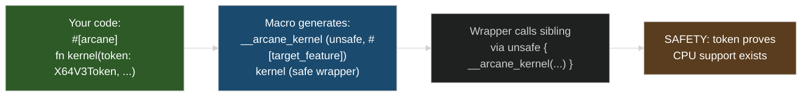
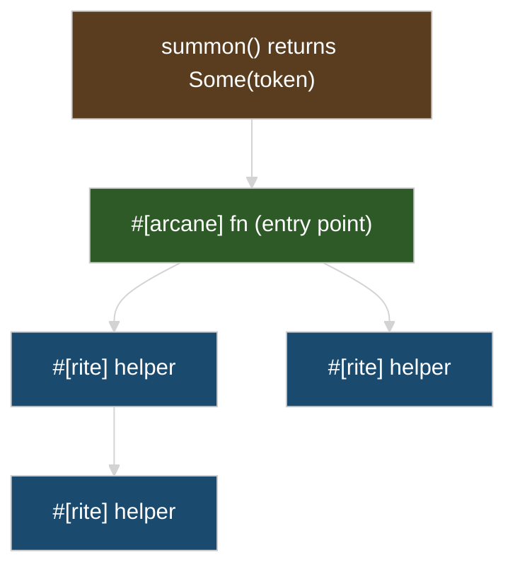

# The #[arcane] Macro <sub>(alias: `#[token_target_features_boundary]`)</sub>

`#[arcane]` creates a safe wrapper around SIMD code. Use it at **entry points**—functions called from non-SIMD code (after `summon()`, from tests, public APIs).

For internal helpers called from other SIMD functions, use [`#[rite]`](./rite.md) instead — it inlines into the caller, avoiding the target-feature boundary.

> **Rust 1.85+ safety**: Inside the generated `#[target_feature]` function, value-based SIMD intrinsics (arithmetic, shuffle, compare, bitwise) are safe — no `unsafe` needed. Only pointer-based memory operations remain unsafe; use `safe_unaligned_simd` for those.

## How It Works

`#[arcane]` generates a sibling function with `#[target_feature]` at the same scope, plus a safe wrapper that calls it. Both functions live in the same scope, so `self` and `Self` work naturally in methods.


```mermaid
%%{init: { 'theme': 'dark' }}%%
flowchart LR
    A["Your code:<br/>#[arcane]<br/>fn kernel(token: X64V3Token, ...)"] --> B["Macro generates:<br/>__arcane_kernel (unsafe, #[target_feature])<br/>kernel (safe wrapper)"]
    B --> C["Wrapper calls sibling<br/>via unsafe { __arcane_kernel(...) }"]
    C --> D["SAFETY: token proves<br/>CPU support exists"]

    style A fill:#2d5a27,color:#fff
    style B fill:#1a4a6e,color:#fff
    style D fill:#5a3d1e,color:#fff
```


```mermaid
%%{init: { 'theme': 'dark' }}%%
flowchart TD
    S["summon() returns Some(token)"] --> A["#[arcane] fn (entry point)"]
    A --> R1["#[rite] helper"]
    A --> R2["#[rite] helper"]
    R1 --> R3["#[rite] helper"]

    style S fill:#5a3d1e,color:#fff
    style A fill:#2d5a27,color:#fff
    style R1 fill:#1a4a6e,color:#fff
    style R2 fill:#1a4a6e,color:#fff
    style R3 fill:#1a4a6e,color:#fff
```

`#[arcane]` sits at the boundary between non-SIMD and SIMD code. Everything below it in the call tree uses `#[rite]`.

## Basic Usage

```rust
use archmage::prelude::*;

#[arcane(import_intrinsics)]
fn add_vectors(_token: X64V3Token, a: &[f32; 8], b: &[f32; 8]) -> [f32; 8] {
    // safe_unaligned_simd takes references - fully safe inside #[arcane]!
    let va = _mm256_loadu_ps(a);
    let vb = _mm256_loadu_ps(b);
    let sum = _mm256_add_ps(va, vb);

    let mut out = [0.0f32; 8];
    _mm256_storeu_ps(&mut out, sum);
    out
}
```

## What It Generates

**Sibling mode (default):** Two functions at the same scope. `self`/`Self` work naturally.

<details>
<summary>Sibling expansion (click to expand)</summary>

```rust
// Your code:
#[arcane(import_intrinsics)]
fn add(token: X64V3Token, a: __m256, b: __m256) -> __m256 {
    _mm256_add_ps(a, b)
}

// Generated (x86_64 only — cfg'd out on other architectures):
#[cfg(target_arch = "x86_64")]
#[doc(hidden)]
#[target_feature(enable = "avx2,fma,bmi1,bmi2,...")]
fn __arcane_add(token: X64V3Token, a: __m256, b: __m256) -> __m256 {
    _mm256_add_ps(a, b)
}

#[cfg(target_arch = "x86_64")]
fn add(token: X64V3Token, a: __m256, b: __m256) -> __m256 {
    unsafe { __arcane_add(token, a, b) }
}
```

</details>

**Nested mode** (`#[arcane(nested)]` or `#[arcane(_self = Type)]`): Inner function inside the original. Required for trait impls, since sibling expansion would add methods not in the trait definition.

<details>
<summary>Nested expansion (click to expand)</summary>

```rust
// Trait impl — must use nested:
impl SimdOps for MyType {
    #[arcane(_self = MyType, import_intrinsics)]
    fn compute(&self, token: X64V3Token) -> f32 {
        _self.data.iter().sum()
    }
}

// Generated:
impl SimdOps for MyType {
    fn compute(&self, token: X64V3Token) -> f32 {
        #[target_feature(enable = "avx2,fma,...")]
        #[inline]
        fn __inner(_self: &MyType, token: X64V3Token) -> f32 {
            _self.data.iter().sum()
        }
        unsafe { __inner(self, token) }
    }
}
```

</details>

## Token-to-Features Mapping

| Token | Enabled Features |
|-------|------------------|
| `X64V1Token` / `Sse2Token` | sse, sse2 (x86-64 baseline) |
| `X64V2Token` | + sse3, ssse3, sse4.1, sse4.2, popcnt |
| `X64CryptoToken` | V2 + pclmulqdq, aes |
| `X64V3Token` | + avx, avx2, fma, bmi1, bmi2, f16c |
| `X64V3CryptoToken` | V3 + vpclmulqdq, vaes |
| `X64V4Token` / `Server64` | + avx512f, avx512bw, avx512cd, avx512dq, avx512vl |
| `X64V4xToken` | V4 + vpopcntdq, ifma, vbmi, vnni, vbmi2, bitalg, vpclmulqdq, gfni, vaes |
| `Avx512Fp16Token` | V4 + avx512fp16 |
| `NeonToken` / `Arm64` | neon |
| `Arm64V2Token` | neon + crc, rdm, dotprod, fp16, aes, sha2 |
| `Arm64V3Token` | V2 + fhm, fcma, sha3, i8mm, bf16 |
| `NeonAesToken` | neon + aes |
| `NeonSha3Token` | neon + sha3 |
| `NeonCrcToken` | neon + crc |
| `Wasm128Token` | simd128 |
| `Wasm128RelaxedToken` | simd128 + relaxed-simd |

See [`token-registry.toml`](https://github.com/imazen/archmage/blob/main/token-registry.toml) for the complete mapping.

## Nesting #[arcane] Functions

Functions with the same token type inline into each other:

```rust
use magetypes::simd::f32x8;

#[arcane(import_intrinsics)]
fn outer(token: X64V3Token, data: &[f32; 8]) -> f32 {
    let sum = inner(token, data);  // Inlines!
    sum * 2.0
}

#[arcane(import_intrinsics)]
fn inner(token: X64V3Token, data: &[f32; 8]) -> f32 {
    // Both functions share the same #[target_feature] region
    // LLVM optimizes across both
    let v = f32x8::from_array(token, *data);
    v.reduce_add()
}
```

## Downcasting Tokens

Higher tokens can call functions expecting lower tokens:

```rust
use magetypes::simd::f32x8;

#[arcane(import_intrinsics)]
fn v4_kernel(token: X64V4Token, data: &[f32; 8]) -> f32 {
    // V4 ⊃ V3, so this works and inlines properly
    v3_sum(token, data)
    // ... could do AVX-512 specific work too ...
}

#[arcane(import_intrinsics)]
fn v3_sum(token: X64V3Token, data: &[f32; 8]) -> f32 {
    // Actual SIMD: load 8 floats, horizontal sum
    let v = f32x8::from_array(token, *data);
    v.reduce_add()
}
```

## Cross-Architecture Behavior

**Default (cfg-out):** On non-matching architectures, no function is emitted. Code referencing it must use `#[cfg]` guards or `incant!`.

**With `stub`:** `#[arcane(stub)]` generates an `unreachable!()` stub on wrong architectures.

See [Cross-Platform](./cross-platform.md) for dispatch patterns.

## Options

| Option | Effect |
|--------|--------|
| `#[arcane]` | Sibling expansion, cfg-out on wrong arch |
| `#[arcane(stub)]` | Sibling expansion, unreachable stub on wrong arch |
| `#[arcane(nested)]` | Nested inner function (old behavior) |
| `#[arcane(_self = Type)]` | Implies nested, replaces `self`→`_self` |
| `#[arcane(nested, stub)]` | Nested + stub |
| `#[arcane(inline_always)]` | Force `#[inline(always)]` (nightly only) |

### `stub`

Generate an `unreachable!()` stub on non-matching architectures:

```rust
#[arcane(stub, import_intrinsics)]
fn process(token: X64V3Token, data: &[f32]) -> f32 {
    data.iter().sum()
}
```

### `nested`

Use the nested inner-function approach. **Required for trait impls** — sibling generates `__arcane_fn` which isn't a member of the trait.

### `inline_always`

Force aggressive inlining (requires nightly):

```rust
#![feature(target_feature_inline_always)]

#[arcane(inline_always, import_intrinsics)]
fn hot_path(token: X64V3Token, data: &[f32]) -> f32 {
    // Uses #[inline(always)] instead of #[inline]
}
```

## Common Patterns

### Public API with Internal Implementation

```rust
pub fn process(data: &mut [f32]) {
    if let Some(token) = X64V3Token::summon() {
        process_simd(token, data);
    } else {
        process_scalar(data);
    }
}

#[arcane(import_intrinsics)]
fn process_simd(token: X64V3Token, data: &mut [f32]) {
    // SIMD implementation
}

fn process_scalar(data: &mut [f32]) {
    // Fallback
}
```

### Generic Over Tokens

```rust
use archmage::HasX64V2;

#[arcane(import_intrinsics)]
fn generic_impl<T: HasX64V2>(token: T, a: __m128, b: __m128) -> __m128 {
    // Works with X64V2Token, X64V3Token, X64V4Token
    // Note: generic bounds create optimization boundaries
    _mm_add_ps(a, b)
}
```

**Warning**: Generic bounds prevent inlining across the boundary. Prefer concrete tokens for hot paths.
