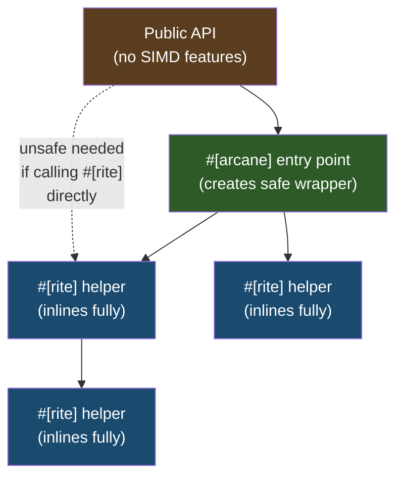

# The #[rite] Macro

`#[rite]` should be your **default choice** for SIMD functions. It adds `#[target_feature]` + `#[inline]` directly—no wrapper overhead.

Use `#[arcane]` only at **entry points** where the token comes from the outside world.

## How It Works


No wrapper. No inner function. Just attributes on your function. That's why it's zero overhead — there's nothing extra to call through.



## The Rule

| Caller | Use |
|--------|-----|
| Called from `#[arcane]` or `#[rite]` with same/compatible token | `#[rite]` |
| Called from non-SIMD code (tests, public API, after `summon()`) | `#[arcane]` |

**Default to `#[rite]}`.** Only use `#[arcane]` when you need the safe wrapper.

```rust
use archmage::prelude::*;

// ENTRY POINT: receives token from caller
#[arcane]
pub fn dot_product(token: Desktop64, a: &[f32; 8], b: &[f32; 8]) -> f32 {
    let products = mul_vectors(token, a, b);  // Calls #[rite] helper
    horizontal_sum(token, products)
}

// INNER HELPER: only called from #[arcane] context
#[rite]
fn mul_vectors(_token: Desktop64, a: &[f32; 8], b: &[f32; 8]) -> __m256 {
    // safe_unaligned_simd takes references - no unsafe needed!
    let va = _mm256_loadu_ps(a);
    let vb = _mm256_loadu_ps(b);
    _mm256_mul_ps(va, vb)
}

// INNER HELPER: only called from #[arcane] context
#[rite]
fn horizontal_sum(_token: Desktop64, v: __m256) -> f32 {
    let sum = _mm256_hadd_ps(v, v);
    let sum = _mm256_hadd_ps(sum, sum);
    let low = _mm256_castps256_ps128(sum);
    let high = _mm256_extractf128_ps::<1>(sum);
    _mm_cvtss_f32(_mm_add_ss(low, high))
}
```

## What It Generates

<details>
<summary>Macro expansion (click to expand)</summary>

```rust
// Your code:
#[rite]
fn helper(_token: Desktop64, v: __m256) -> __m256 {
    _mm256_add_ps(v, v)
}

// Generated (NO wrapper function):
#[target_feature(enable = "avx2,fma,bmi1,bmi2")]
#[inline]
fn helper(_token: Desktop64, v: __m256) -> __m256 {
    _mm256_add_ps(v, v)
}
```

Compare to `#[arcane]` which creates a wrapper:
```rust
fn helper(_token: Desktop64, v: __m256) -> __m256 {
    #[target_feature(enable = "avx2,fma,bmi1,bmi2")]
    #[inline]
    unsafe fn __inner(_token: Desktop64, v: __m256) -> __m256 {
        _mm256_add_ps(v, v)
    }
    unsafe { __inner(_token, v) }
}
```

</details>

## Why This Works (Rust 1.85+)

Since Rust 1.85, calling a `#[target_feature]` function from another function with matching or superset features is **safe**—no `unsafe` block needed:

```rust
#[target_feature(enable = "avx2,fma")]
fn outer(data: &[f32; 8]) -> f32 {
    inner_add(data) + inner_mul(data)  // Safe! No unsafe needed!
}

#[target_feature(enable = "avx2")]
#[inline]
fn inner_add(data: &[f32; 8]) -> f32 { /* ... */ }

#[target_feature(enable = "avx2")]
#[inline]
fn inner_mul(data: &[f32; 8]) -> f32 { /* ... */ }
```

The caller's features (`avx2,fma`) are a superset of the callee's (`avx2`), so the compiler knows the call is safe.

## Direct Calls Require Unsafe

If you call a `#[rite]` function from outside a `#[target_feature]` context, you need `unsafe`:

```rust
#[test]
fn test_helper() {
    if let Some(token) = Desktop64::summon() {
        // Direct call from test (no target_feature) requires unsafe
        let result = unsafe { helper(token, data) };
        assert_eq!(result, expected);
    }
}
```

This is correct—the test function doesn't have `#[target_feature]`, so the compiler can't verify safety at compile time. The `unsafe` block says "I checked at runtime via `summon()`."

## Benefits

1. **Zero wrapper overhead**: No extra function call indirection
2. **Better inlining**: LLVM sees the actual function, not a wrapper
3. **Cleaner stack traces**: No `__inner` functions in backtraces
4. **Syntactic sugar**: No need to manually maintain feature strings

## Choosing Between #[arcane] and #[rite]

**Default to `#[rite]`** — only use `#[arcane]` when necessary.

| Situation | Use | Why |
|-----------|-----|-----|
| Internal helper | `#[rite]` | Zero overhead, inlines fully |
| Composable building blocks | `#[rite]` | Same target features = one optimization region |
| Most SIMD functions | `#[rite]` | This should be your default |
| Entry point (receives token from outside) | `#[arcane]` | Needs safe wrapper |
| Public API | `#[arcane]` | Callers aren't in target_feature context |
| Called from tests | `#[arcane]` | Tests aren't in target_feature context |

## Composing Helpers

`#[rite]` helpers compose naturally:

```rust
#[rite]
fn complex_op(token: Desktop64, a: &[f32; 8], b: &[f32; 8], c: &[f32; 8]) -> f32 {
    let ab = mul_vectors(token, a, b);       // Calls another #[rite]
    let vc = load_vector(token, c);          // Calls another #[rite]
    let sum = add_vectors_raw(token, ab, vc); // Calls another #[rite]
    horizontal_sum(token, sum)                // Calls another #[rite]
}
```

All helpers inline into the caller with zero overhead.

## Inlining Behavior

`#[rite]` uses `#[inline]` which is **sufficient** for full inlining when called from matching `#[target_feature]` context. Benchmarks show `#[rite]` with `#[inline]` performs identically to manually inlined code.

**Note:** `#[inline(always)]` combined with `#[target_feature]` is not allowed on stable Rust, so we can't use it anyway. The good news is we don't need it—`#[inline]` works perfectly.

```
Benchmark results (1000 iterations, 8-float vector add):
  arcane_in_loop:     2.32 µs  (4.1x slower - wrapper overhead)
  rite_in_arcane:     572 ns   (baseline - full inlining)
  manual_inline:      570 ns   (baseline)
```
