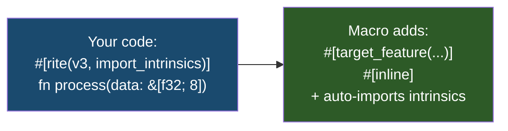
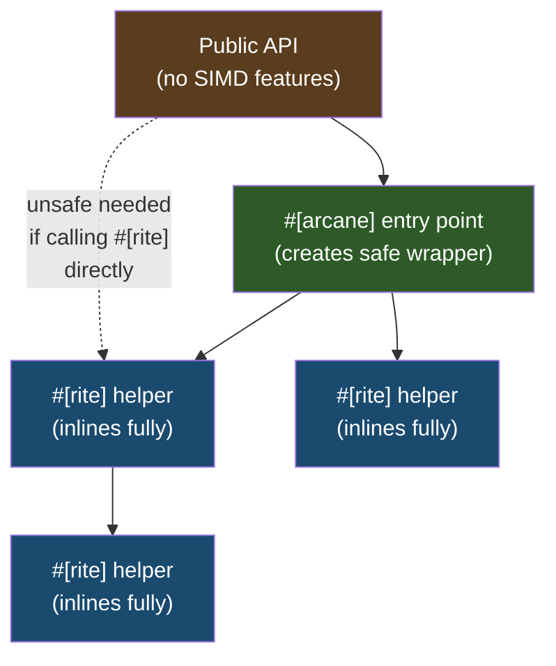

# The #[rite] Macro <sub>(alias: `#[token_target_features]`)</sub>

`#[rite]` should be your **default choice** for SIMD functions. It adds `#[target_feature]` + `#[inline]` directly to your function, so LLVM can inline it into any caller with matching features.

Use `#[arcane]` only at **entry points** where the token comes from the outside world.

## Three Modes

`#[rite]` works in three modes:

```rust
// 1. Token-based: token parameter determines features
#[rite(import_intrinsics)]
fn helper(_token: X64V3Token, data: &[f32; 8]) -> __m256 {
    _mm256_loadu_ps(data)
}

// 2. Tier-based: tier name determines features, no token needed
#[rite(v3, import_intrinsics)]
fn helper(data: &[f32; 8]) -> __m256 {
    _mm256_loadu_ps(data)
}

// 3. Multi-tier: generates suffixed variants for each tier
#[rite(v3, v4, neon, import_intrinsics)]
fn process(data: &[f32; 4]) -> f32 {
    data[0] + data[1] + data[2] + data[3]
}
// Produces: process_v3(), process_v4(), process_neon()
```

Token-based and tier-based generate one function with identical attributes. The token form can be easier to remember if you already have the token in scope. Multi-tier generates a suffixed copy of the function for each tier, each compiled with different `#[target_feature]` attributes.

## How It Works


```mermaid
flowchart LR
    A["Your code:<br/>#[rite(v3, import_intrinsics)]<br/>fn process(data: &[f32; 8])"] --> B["Macro adds:<br/>#[target_feature(...)]<br/>#[inline]<br/>+ auto-imports intrinsics"]

    style A fill:#1a4a6e,color:#fff
    style B fill:#2d5a27,color:#fff
```

No inner function. Just attributes on your function. LLVM inlines it into any caller with matching `#[target_feature]` — keeping everything in one optimization region.


```mermaid
flowchart TD
    PUB["Public API<br/>(no SIMD features)"] --> ARC["#[arcane] entry point<br/>(creates safe wrapper)"]
    ARC --> H1["#[rite] helper<br/>(inlines fully)"]
    ARC --> H2["#[rite] helper<br/>(inlines fully)"]
    H1 --> H3["#[rite] helper<br/>(inlines fully)"]

    PUB -.->|"unsafe needed<br/>if calling #[rite]<br/>directly"| H1

    style PUB fill:#5a3d1e,color:#fff
    style ARC fill:#2d5a27,color:#fff
    style H1 fill:#1a4a6e,color:#fff
    style H2 fill:#1a4a6e,color:#fff
    style H3 fill:#1a4a6e,color:#fff
```

## The Rule

| Caller | Use |
|--------|-----|
| Called from `#[arcane]` or `#[rite]` with same/compatible features | `#[rite(v3)]` or `#[rite]` with token |
| Called from non-SIMD code (tests, public API, after `summon()`) | `#[arcane]` |

**Default to `#[rite]`.** Only use `#[arcane]` when you need the safe wrapper.

```rust
use archmage::prelude::*;

// ENTRY POINT: receives token from caller
#[arcane(import_intrinsics)]
pub fn dot_product(token: X64V3Token, a: &[f32; 8], b: &[f32; 8]) -> f32 {
    let products = mul_vectors(a, b);       // tier-based — no token needed
    horizontal_sum(token, products)          // token-based — passes token on
}

// Tier-based: no token parameter, just specify the tier
#[rite(v3, import_intrinsics)]
fn mul_vectors(a: &[f32; 8], b: &[f32; 8]) -> __m256 {
    _mm256_mul_ps(_mm256_loadu_ps(a), _mm256_loadu_ps(b))
}

// Token-based: same behavior, token threaded through
#[rite(import_intrinsics)]
fn horizontal_sum(_token: X64V3Token, v: __m256) -> f32 {
    let sum = _mm256_hadd_ps(v, v);
    let sum = _mm256_hadd_ps(sum, sum);
    let low = _mm256_castps256_ps128(sum);
    let high = _mm256_extractf128_ps::<1>(sum);
    _mm_cvtss_f32(_mm_add_ss(low, high))
}
```

## What It Generates

<details>
<summary>Single-tier expansion (click to expand)</summary>

```rust
// Your code:
#[rite(v3, import_intrinsics)]
fn helper(v: __m256) -> __m256 {
    _mm256_add_ps(v, v)
}

// Generated (NO wrapper function):
#[cfg(target_arch = "x86_64")]
#[target_feature(enable = "avx2,fma,bmi1,bmi2,...")]
#[inline]
fn helper(v: __m256) -> __m256 {
    use archmage::intrinsics::x86_64::*;
    _mm256_add_ps(v, v)
}
```

Compare to `#[arcane]` which creates a wrapper:
```rust
fn helper(_token: X64V3Token, v: __m256) -> __m256 {
    #[target_feature(enable = "avx2,fma,bmi1,bmi2,...")]
    #[inline]
    fn __inner(_token: X64V3Token, v: __m256) -> __m256 {
        _mm256_add_ps(v, v)
    }
    unsafe { __inner(_token, v) }
}
```

</details>

<details>
<summary>Multi-tier expansion (click to expand)</summary>

```rust
// Your code:
#[rite(v3, v4, import_intrinsics)]
fn process(data: &[f32; 4]) -> f32 {
    data.iter().sum()
}

// Generated — two suffixed variants:
#[cfg(target_arch = "x86_64")]
#[target_feature(enable = "avx2,fma,...")]
#[inline]
fn process_v3(data: &[f32; 4]) -> f32 { ... }

#[cfg(target_arch = "x86_64")]
#[target_feature(enable = "avx512f,...")]
#[inline]
fn process_v4(data: &[f32; 4]) -> f32 { ... }
```

The original function name disappears — only the suffixed variants exist.

</details>

## Multi-Tier `#[rite]`

When you specify more than one tier, `#[rite]` generates a separate suffixed function for each:

```rust
// One function body, compiled for two tiers
#[rite(v3, v4)]
fn scale(data: &[f32; 4], factor: f32) -> [f32; 4] {
    [data[0] * factor, data[1] * factor, data[2] * factor, data[3] * factor]
}
// Generates: scale_v3() and scale_v4()
```

Call the suffixed variant from a matching context:

```rust
#[arcane(import_intrinsics)]
fn entry(token: X64V3Token, data: &[f32; 4]) -> [f32; 4] {
    scale_v3(data, 2.0)  // Safe — caller has V3 features, callee needs V3
}
```

Since Rust 1.85, `#[target_feature]` functions can safely call other `#[target_feature]` functions when the caller has matching or superset features.

## Why This Works (Rust 1.85+)

Since Rust 1.85, calling a `#[target_feature]` function from another function with matching or superset features is **safe** — no `unsafe` block needed. This is what makes `#[rite]` functions callable from `#[arcane]` or other `#[rite]` functions without `unsafe`:

```rust
#[target_feature(enable = "avx2,fma")]
fn outer(data: &[f32; 8]) -> f32 {
    inner_add(data) + inner_mul(data)  // Safe! No unsafe needed!
}

#[target_feature(enable = "avx2")]
#[inline]
fn inner_add(data: &[f32; 8]) -> f32 { /* ... */ }

#[target_feature(enable = "avx2")]
#[inline]
fn inner_mul(data: &[f32; 8]) -> f32 { /* ... */ }
```

The caller's features (`avx2,fma`) are a superset of the callee's (`avx2`), so the compiler knows the call is safe.

## Direct Calls Require Unsafe

If you call a `#[rite]` function from outside a `#[target_feature]` context, you need `unsafe`:

```rust
#[test]
fn test_helper() {
    if let Some(token) = X64V3Token::summon() {
        // Direct call from test (no target_feature) requires unsafe
        let result = unsafe { helper(token, data) };
        assert_eq!(result, expected);
    }
}
```

This is correct—the test function doesn't have `#[target_feature]`, so the compiler can't verify safety at compile time. The `unsafe` block says "I checked at runtime via `summon()`."

## Benefits

1. **No target-feature boundary**: Inlines into callers with matching features
2. **Better inlining**: LLVM sees the actual function with matching target attributes
3. **Cleaner stack traces**: No `__inner` functions in backtraces
4. **Syntactic sugar**: No need to manually maintain feature strings

## Choosing Between #[arcane] and #[rite]

**Default to `#[rite]`** — only use `#[arcane]` when necessary.

| Situation | Use | Why |
|-----------|-----|-----|
| Internal helper, doesn't need token | `#[rite(v3)]` | Cleanest — no token threading |
| Internal helper, passes token to magetypes | `#[rite]` with token | Token needed for magetypes constructors |
| Multi-tier auto-vectorization | `#[rite(v3, v4, neon)]` | One body, multiple compiled variants |
| Entry point (receives token from outside) | `#[arcane]` | Needs safe wrapper |
| Public API | `#[arcane]` | Callers aren't in target_feature context |
| Called from tests | `#[arcane]` | Tests aren't in target_feature context |

## Composing Helpers

`#[rite]` helpers compose naturally — both token-based and tier-based:

```rust
#[rite(v3, import_intrinsics)]
fn complex_op(a: &[f32; 8], b: &[f32; 8], c: &[f32; 8]) -> __m256 {
    let ab = mul_vectors(a, b);       // Another #[rite(v3)] — no token
    let vc = load_vector(c);          // Inlines fully
    add_vectors_raw(ab, vc)           // No target-feature boundary
}
```

All helpers inline into the caller — no target-feature boundary, one optimization region.

## Inlining Behavior

`#[rite]` uses `#[inline]` which is sufficient for full inlining when called from matching `#[target_feature]` context. Benchmarks show `#[rite]` with `#[inline]` performs identically to manually inlined code — 547 ns vs 544 ns on 1000 8-float vector adds. Calling `#[arcane]` per iteration instead costs 4x (simple adds) to 6.2x (DCT-8). See the [full benchmark data](../../../PERFORMANCE.md).

`#[inline(always)]` combined with `#[target_feature]` is not allowed on stable Rust, but we don't need it — `#[inline]` works perfectly.

## Options Reference

All options combine freely. Order doesn't matter.

| Option | Effect |
|--------|--------|
| `v3`, `neon`, `v4`, ... | Tier name — one = single function, multiple = suffixed variants |
| `import_intrinsics` | Injects `use archmage::intrinsics::{arch}::*` (safe memory ops) |
| `import_magetypes` | Injects magetypes SIMD type imports |

## Cross-Architecture Behavior

Like `#[arcane]`, `#[rite]` cfg-gates functions to the matching architecture by default. On non-matching architectures, no function is emitted. For multi-tier, each variant gets its own cfg guard. Use `incant!` for cross-arch dispatch.
