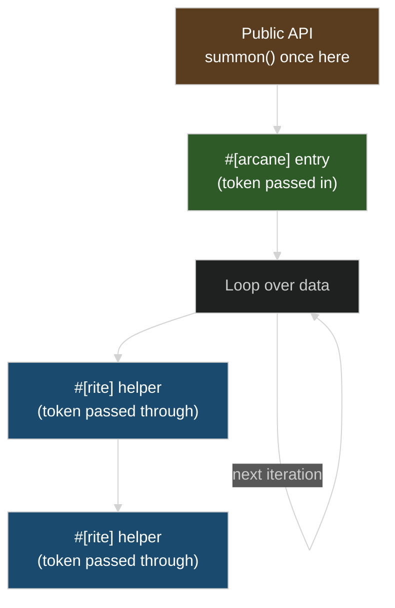

# Token Hoisting

Summon tokens once at your API boundary and pass them through. The cost isn't `summon()` itself (~1.3 ns cached) — it's the `#[target_feature]` boundary. Each `#[arcane]` wrapper is a transition between LLVM optimization regions: the caller has baseline features, the callee has AVX2+FMA. LLVM can't optimize across that boundary. We measured a 42% regression from dispatching per-call instead of per-batch.



## Example

```rust
use archmage::{X64V3Token, SimdToken, arcane};
use magetypes::simd::f32x8;

fn find_closest(points: &[[f32; 8]], query: &[f32; 8]) -> usize {
    if let Some(token) = X64V3Token::summon() {
        find_closest_simd(token, points, query)
    } else {
        find_closest_scalar(points, query)
    }
}

#[arcane]
fn find_closest_simd(token: X64V3Token, points: &[[f32; 8]], query: &[f32; 8]) -> usize {
    let mut best_idx = 0;
    let mut best_dist = f32::MAX;

    for (i, point) in points.iter().enumerate() {
        let d = distance_simd(token, point, query);
        if d < best_dist {
            best_dist = d;
            best_idx = i;
        }
    }
    best_idx
}

#[arcane]
fn distance_simd(token: X64V3Token, a: &[f32; 8], b: &[f32; 8]) -> f32 {
    let va = f32x8::from_array(token, *a);
    let vb = f32x8::from_array(token, *b);
    let diff = va - vb;
    (diff * diff).reduce_add().sqrt()
}
```

The pattern: `summon()` at the public entry point, then pass the token through the call chain. The token is zero-sized — passing it costs nothing at runtime.

## Why This Matters: Target Feature Boundaries

`#[target_feature(enable = "avx2,fma,...")]` changes LLVM's compilation target for that function. When two functions share the same target features, LLVM optimizes across them freely — inlining, constant propagation, instruction combining all work. When they differ, LLVM must be conservative at the boundary.

Every `#[arcane]` call from non-SIMD code crosses this boundary. If your hot loop calls `#[arcane]` each iteration, that's a boundary crossing per iteration — LLVM sees each call as leaving one optimization region and entering another. Moving the loop *inside* `#[arcane]` means one boundary crossing total, with `#[rite]` helpers inlining freely within the same target-feature region.

## With `-Ctarget-cpu=native`

When the compiler knows the target has the features, `summon()` compiles away entirely and the whole binary shares the same LLVM target — no boundaries at all:

```bash
RUSTFLAGS="-Ctarget-cpu=native" cargo build --release
```

Even so, hoisting is still good practice — your code works correctly when compiled without target-cpu.

## Summary

| Pattern | Performance |
|---------|-------------|
| `#[arcane]` called per iteration | 42% slower (target-feature boundary per call) |
| Loop inside `#[arcane]`, `#[rite]` helpers | Optimal (one boundary, one optimization region) |
| With `-Ctarget-cpu=native` | Optimal (no boundaries, features are global) |
