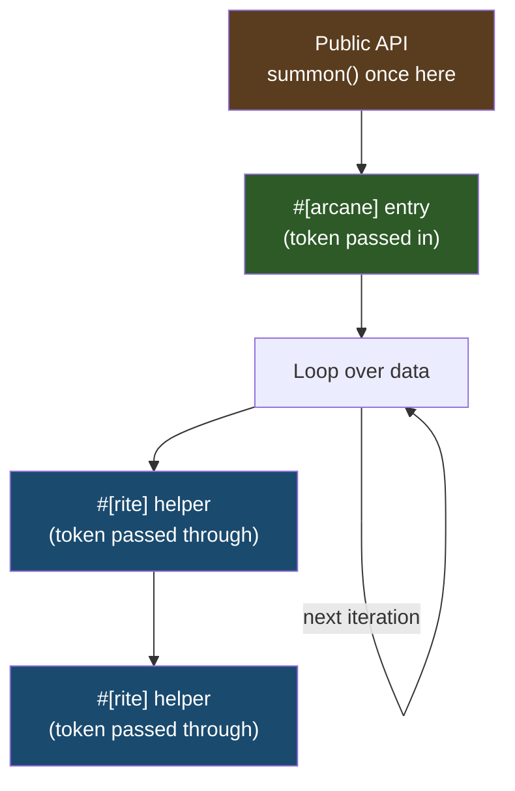

# Token Hoisting

Summon tokens once at your API boundary and pass them through. `summon()` hits an atomic cache (~1.3 ns), but in a hot inner loop that adds up fast — we measured a 42% regression from summoning per-call instead of per-batch.



## Example

```rust
use archmage::{X64V3Token, SimdToken, arcane};
use magetypes::simd::f32x8;

fn find_closest(points: &[[f32; 8]], query: &[f32; 8]) -> usize {
    if let Some(token) = X64V3Token::summon() {
        find_closest_simd(token, points, query)
    } else {
        find_closest_scalar(points, query)
    }
}

#[arcane]
fn find_closest_simd(token: X64V3Token, points: &[[f32; 8]], query: &[f32; 8]) -> usize {
    let mut best_idx = 0;
    let mut best_dist = f32::MAX;

    for (i, point) in points.iter().enumerate() {
        let d = distance_simd(token, point, query);
        if d < best_dist {
            best_dist = d;
            best_idx = i;
        }
    }
    best_idx
}

#[arcane]
fn distance_simd(token: X64V3Token, a: &[f32; 8], b: &[f32; 8]) -> f32 {
    let va = f32x8::from_array(token, *a);
    let vb = f32x8::from_array(token, *b);
    let diff = va - vb;
    (diff * diff).reduce_add().sqrt()
}
```

The pattern: `summon()` at the public entry point, then pass the token through the call chain. The token is zero-sized — passing it costs nothing at runtime.

## With `-Ctarget-cpu=native`

When the compiler knows the target has the features, `summon()` compiles away entirely:

```bash
RUSTFLAGS="-Ctarget-cpu=native" cargo build --release
```

Even so, hoisting is still good practice — your code works correctly when compiled without target-cpu.

## Summary

| Pattern | Performance |
|---------|-------------|
| `summon()` in hot loop | 42% slower |
| `summon()` at API boundary | Optimal |
| `summon()` with `-Ctarget-cpu` | Optimal (compiles away) |
