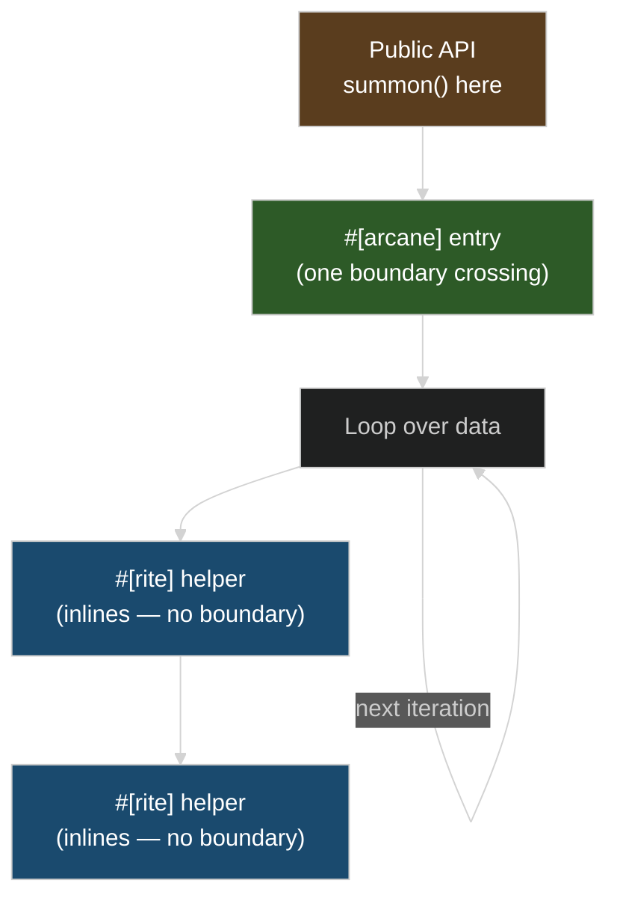

# Target-Feature Boundaries

The biggest performance pitfall with SIMD isn't `summon()` cost (~1.3 ns cached) — it's calling `#[arcane]` functions from inside hot loops. Each call crosses a `#[target_feature]` boundary that LLVM can't optimize across: 4x slower in benchmarks. Token hoisting alone doesn't fix this — even with the token pre-summoned, each `#[arcane]` call still hits the boundary.

The fix: enter `#[arcane]` once, put your loop inside it, and use `#[rite]` for helpers.



## Example

```rust
use archmage::{X64V3Token, SimdToken, arcane, rite};
use magetypes::simd::f32x8;

fn find_closest(points: &[[f32; 8]], query: &[f32; 8]) -> usize {
    if let Some(token) = X64V3Token::summon() {
        find_closest_simd(token, points, query)
    } else {
        find_closest_scalar(points, query)
    }
}

// Entry point: #[arcane] — one boundary crossing
#[arcane]
fn find_closest_simd(token: X64V3Token, points: &[[f32; 8]], query: &[f32; 8]) -> usize {
    let mut best_idx = 0;
    let mut best_dist = f32::MAX;

    for (i, point) in points.iter().enumerate() {
        let d = distance_simd(token, point, query);  // #[rite] inlines here
        if d < best_dist {
            best_dist = d;
            best_idx = i;
        }
    }
    best_idx
}

// Inner helper: #[rite] — inlines into caller, no boundary
#[rite]
fn distance_simd(token: X64V3Token, a: &[f32; 8], b: &[f32; 8]) -> f32 {
    let va = f32x8::from_array(token, *a);
    let vb = f32x8::from_array(token, *b);
    let diff = va - vb;
    (diff * diff).reduce_add().sqrt()
}
```

## Why This Matters

`#[target_feature(enable = "avx2,fma,...")]` changes LLVM's compilation target for that function. LLVM cannot inline a function with extended target features into a caller with baseline features. Each `#[arcane]` call from non-SIMD code crosses this boundary — LLVM can't hoist loads, sink stores, or optimize across iterations.

This is not archmage overhead. A bare `#[target_feature]` function without archmage has the same cost (verified in `benches/asm_inspection.rs` — pattern 7). The boundary is inherent to how LLVM handles `#[target_feature]`.

The fix is `#[rite]`: it adds `#[target_feature]` + `#[inline]` directly, so LLVM can inline it into any caller with matching features. Everything inside one `#[arcane]` entry point shares the same LLVM target — `#[rite]` helpers inline freely.

## With `-Ctarget-cpu=native`

When the compiler knows the target has the features, `summon()` compiles away entirely and the whole binary shares the same LLVM target — no boundaries at all:

```bash
RUSTFLAGS="-Ctarget-cpu=native" cargo build --release
```

## Benchmark results

From `cargo bench --bench asm_inspection` (1000 iterations, 8-float vector add):

| Pattern | Time | Why |
|---------|------|-----|
| `#[rite]` in `#[arcane]` | 547 ns | Features match → LLVM inlines |
| Manual inline in `#[arcane]` | 544 ns | Same LLVM region |
| `#[arcane]` per iteration | 2209 ns (4x) | Boundary per call |
| Bare `#[target_feature]` (no archmage) | 2222 ns (4x) | Same boundary — not archmage's fault |
| With `-Ctarget-cpu=native` | Optimal | No boundaries, features are global |
