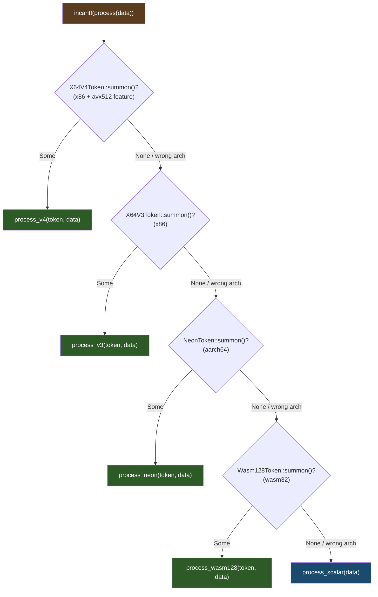
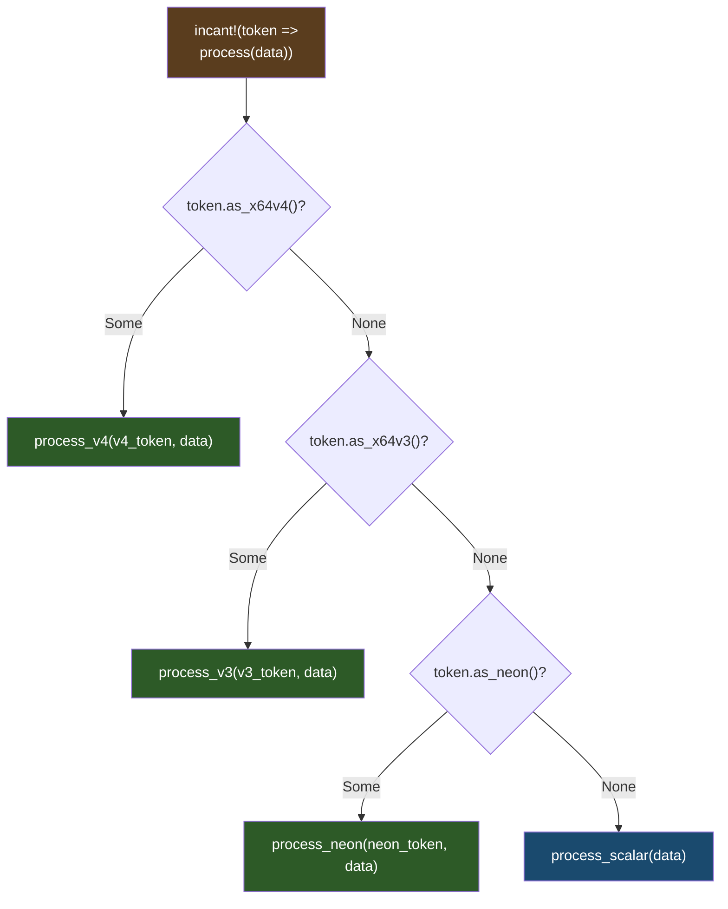

# incant! Macro

`incant!` automates dispatch to suffixed function variants. Write one call, get automatic fallback through capability tiers.

## Dispatch Flow



Missing variants are skipped at compile time. You only need to implement the platforms you care about plus `_scalar`.

### Passthrough Mode



Passthrough uses `IntoConcreteToken` to check what the token actually is, without re-summoning.

## Basic Usage

```rust
use archmage::{incant, arcane};
use magetypes::simd::f32x8;

// Define variants with standard suffixes
#[arcane]
fn sum_v3(token: X64V3Token, data: &[f32; 8]) -> f32 {
    f32x8::from_array(token, *data).reduce_add()
}

#[arcane]
fn sum_neon(token: NeonToken, data: &[f32; 4]) -> f32 {
    // NEON implementation
}

fn sum_scalar(data: &[f32]) -> f32 {
    data.iter().sum()
}

// Dispatch automatically
pub fn sum(data: &[f32; 8]) -> f32 {
    incant!(sum(data))
    // Tries: sum_v4 → sum_v3 → sum_neon → sum_wasm128 → sum_scalar
}
```

## How It Works

<details>
<summary>Macro expansion (click to expand)</summary>

```rust
// incant!(process(data)) expands to approximately:
{
    #[cfg(all(target_arch = "x86_64", feature = "avx512"))]
    if let Some(token) = X64V4Token::summon() {
        return process_v4(token, data);
    }

    #[cfg(target_arch = "x86_64")]
    if let Some(token) = X64V3Token::summon() {
        return process_v3(token, data);
    }

    #[cfg(target_arch = "aarch64")]
    if let Some(token) = NeonToken::summon() {
        return process_neon(token, data);
    }

    #[cfg(target_arch = "wasm32")]
    if let Some(token) = Wasm128Token::summon() {
        return process_wasm128(token, data);
    }

    process_scalar(data)
}
```

</details>

## Suffix Conventions

| Suffix | Token | Platform |
|--------|-------|----------|
| `_v4` | `X64V4Token` | x86-64 AVX-512 |
| `_v3` | `X64V3Token` | x86-64 AVX2+FMA |
| `_v2` | `X64V2Token` | x86-64 SSE4.2 |
| `_neon` | `NeonToken` | AArch64 |
| `_wasm128` | `Wasm128Token` | WASM |
| `_scalar` | — | Fallback |

You don't need all variants—`incant!` skips missing ones.

## Passthrough Mode

When you already have a token and want to dispatch to specialized variants:

```rust
fn outer<T: IntoConcreteToken>(token: T, data: &[f32]) -> f32 {
    // Passthrough: token already obtained, dispatch to best variant
    incant!(token => process(data))
}
```

This uses `IntoConcreteToken` to check the token's actual type and dispatch accordingly, without re-summoning.

## Example: Complete Implementation

```rust
use archmage::{arcane, incant, X64V3Token, NeonToken, SimdToken};
use magetypes::simd::f32x8;

// AVX2 variant — #[arcane] generates a stub on non-x86
#[arcane]
fn dot_product_v3(token: X64V3Token, a: &[f32; 8], b: &[f32; 8]) -> f32 {
    let va = f32x8::from_array(token, *a);
    let vb = f32x8::from_array(token, *b);
    (va * vb).reduce_add()
}

// NEON variant (128-bit, so process 4 at a time)
#[arcane]
fn dot_product_neon(token: NeonToken, a: &[f32; 8], b: &[f32; 8]) -> f32 {
    use magetypes::simd::f32x4;
    let sum1 = {
        let va = f32x4::from_slice(token, &a[0..4]);
        let vb = f32x4::from_slice(token, &b[0..4]);
        (va * vb).reduce_add()
    };
    let sum2 = {
        let va = f32x4::from_slice(token, &a[4..8]);
        let vb = f32x4::from_slice(token, &b[4..8]);
        (va * vb).reduce_add()
    };
    sum1 + sum2
}

// Scalar fallback
fn dot_product_scalar(a: &[f32; 8], b: &[f32; 8]) -> f32 {
    a.iter().zip(b.iter()).map(|(x, y)| x * y).sum()
}

// Public API
pub fn dot_product(a: &[f32; 8], b: &[f32; 8]) -> f32 {
    incant!(dot_product(a, b))
}
```

## When to Use incant!

**Use incant! when:**
- You have multiple platform-specific implementations
- You want automatic fallback through tiers
- Function signatures are similar across variants

**Use manual dispatch when:**
- You need custom fallback logic
- Variants have different signatures
- You want more explicit control
