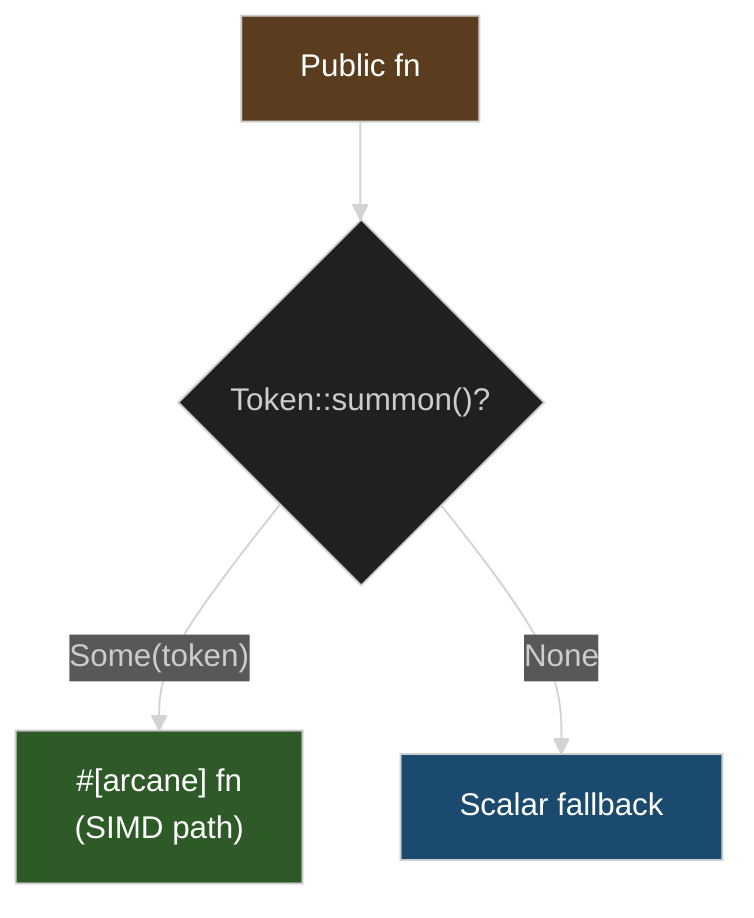

# Manual Dispatch

The simplest dispatch pattern: check for tokens explicitly, call the appropriate implementation.



## Basic Pattern

```rust
use archmage::{Desktop64, SimdToken};

pub fn process(data: &mut [f32]) {
    if let Some(token) = Desktop64::summon() {
        process_avx2(token, data);
    } else {
        process_scalar(data);
    }
}

#[arcane]
fn process_avx2(token: Desktop64, data: &mut [f32]) {
    // AVX2 implementation
}

fn process_scalar(data: &mut [f32]) {
    // Scalar fallback
}
```

**That's it.** No `#[cfg(target_arch)]` needed—this compiles and runs everywhere.

## No Architecture Guards Needed

Tokens exist on all platforms. On unsupported architectures, `summon()` returns `None` and `#[arcane]` functions become unreachable stubs. You write one dispatch block:

```rust
use archmage::{Desktop64, Arm64, Wasm128Token, SimdToken};

pub fn process(data: &mut [f32]) {
    // Try x86 AVX2
    if let Some(token) = Desktop64::summon() {
        return process_x86(token, data);
    }

    // Try ARM NEON
    if let Some(token) = Arm64::summon() {
        return process_arm(token, data);
    }

    // Try WASM SIMD
    if let Some(token) = Wasm128Token::summon() {
        return process_wasm(token, data);
    }

    // Scalar fallback
    process_scalar(data);
}

#[arcane]
fn process_x86(token: Desktop64, data: &mut [f32]) { /* ... */ }

#[arcane]
fn process_arm(token: Arm64, data: &mut [f32]) { /* ... */ }

#[arcane]
fn process_wasm(token: Wasm128Token, data: &mut [f32]) { /* ... */ }

fn process_scalar(data: &mut [f32]) { /* ... */ }
```

On x86-64: `Desktop64::summon()` may succeed, others return `None`.
On ARM: `Arm64::summon()` succeeds, others return `None`.
On WASM: `Wasm128Token::summon()` may succeed, others return `None`.

The `#[arcane]` functions for other architectures compile to unreachable stubs—the code exists but can never be called.

## Multi-Tier x86 Dispatch

Check from highest to lowest capability:

```rust
use archmage::{X64V4Token, Desktop64, X64V2Token, SimdToken};

pub fn process(data: &mut [f32]) {
    // AVX-512 (requires avx512 feature)
    #[cfg(feature = "avx512")]
    if let Some(token) = X64V4Token::summon() {
        return process_v4(token, data);
    }

    // AVX2+FMA (Haswell+, Zen+)
    if let Some(token) = Desktop64::summon() {
        return process_v3(token, data);
    }

    // SSE4.2 (Nehalem+)
    if let Some(token) = X64V2Token::summon() {
        return process_v2(token, data);
    }

    process_scalar(data);
}
```

Note: `#[cfg(feature = "avx512")]` is a **Cargo feature** gate (compile-time opt-in), not an architecture check. The actual CPU detection is still runtime via `summon()`.

## When to Use Manual Dispatch

**Use manual dispatch when:**
- You have 2-3 tiers
- You want explicit, readable control flow
- Different tiers have different APIs

**Consider [`incant!`](./incant.md) when:**
- You have many tiers
- All implementations have the same signature
- You want automatic best-available selection

## Avoiding Common Mistakes

### Don't Dispatch in Hot Loops

```rust
// WRONG - CPUID every iteration
for chunk in data.chunks_mut(8) {
    if let Some(token) = Desktop64::summon() {
        process_chunk(token, chunk);
    }
}

// BETTER - hoist token outside loop
if let Some(token) = Desktop64::summon() {
    for chunk in data.chunks_mut(8) {
        process_chunk(token, chunk);  // But still has #[arcane] wrapper overhead
    }
} else {
    for chunk in data.chunks_mut(8) {
        process_chunk_scalar(chunk);
    }
}

// BEST - put the loop inside #[arcane], call #[rite] helpers
if let Some(token) = Desktop64::summon() {
    process_all_chunks(token, data);
} else {
    process_all_chunks_scalar(data);
}

#[arcane]
fn process_all_chunks(token: Desktop64, data: &mut [f32]) {
    for chunk in data.chunks_exact_mut(8) {
        process_chunk(token, chunk.try_into().unwrap());  // #[rite] inlines fully!
    }
}

#[rite]
fn process_chunk(_: Desktop64, chunk: &mut [f32; 8]) {
    // This inlines into process_all_chunks with zero overhead
}
```

The "BETTER" pattern still calls through an `#[arcane]` wrapper each iteration—an LLVM optimization barrier. The "BEST" pattern puts the loop inside `#[arcane]` and uses `#[rite]` for the inner work, so LLVM sees one optimization region for the entire loop.

### Don't Forget Early Returns

```rust
// WRONG - falls through to scalar even when SIMD available
if let Some(token) = Desktop64::summon() {
    process_avx2(token, data);
    // Missing return!
}
process_scalar(data);  // Always runs!

// RIGHT
if let Some(token) = Desktop64::summon() {
    return process_avx2(token, data);
}
process_scalar(data);
```
