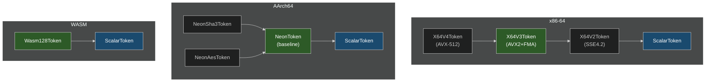

# Tiered Fallback

Real applications need graceful degradation across capability tiers. Here's how to structure robust fallback chains.

## The Tier Hierarchy



Each token implies all the capabilities below it. `summon()` returns the first match.

## Pattern: Capability Waterfall

```rust
use archmage::*;

pub fn process(data: &mut [f32]) -> f32 {
    // Try highest tier first — summon() returns None on wrong architecture
    #[cfg(feature = "avx512")]
    if let Some(token) = X64V4Token::summon() {
        return process_v4(token, data);
    }

    if let Some(token) = X64V3Token::summon() {
        return process_v3(token, data);
    }

    if let Some(token) = X64V2Token::summon() {
        return process_v2(token, data);
    }

    if let Some(token) = NeonToken::summon() {
        return process_neon(token, data);
    }

    if let Some(token) = Wasm128Token::summon() {
        return process_wasm(token, data);
    }

    // Universal fallback
    process_scalar(data)
}
```

## Pattern: Width-Based Tiers

When your algorithm naturally works at different widths:

```rust
use magetypes::*;

pub fn sum_f32(data: &[f32]) -> f32 {
    // Try 256-bit first
    if let Some(token) = X64V3Token::summon() {
        return sum_f32x8(token, data);
    }

    // Fall back to 128-bit
    if let Some(token) = X64V2Token::summon() {
        return sum_f32x4(token, data);
    }

    if let Some(token) = NeonToken::summon() {
        return sum_f32x4_neon(token, data);
    }

    sum_scalar(data)
}

#[arcane]
fn sum_f32x8(token: X64V3Token, data: &[f32]) -> f32 {
    let mut acc = f32x8::zero(token);
    for chunk in data.chunks_exact(8) {
        let v = f32x8::from_slice(token, chunk);
        acc = acc + v;
    }
    // Handle remainder
    let mut sum = acc.reduce_add();
    for &x in data.chunks_exact(8).remainder() {
        sum += x;
    }
    sum
}
```

## Pattern: Feature Detection Cache

For hot paths where you dispatch many times:

```rust
use std::sync::OnceLock;

#[derive(Clone, Copy)]
enum SimdLevel {
    Avx512,
    Avx2,
    Sse42,
    Scalar,
}

static SIMD_LEVEL: OnceLock<SimdLevel> = OnceLock::new();

fn detect_level() -> SimdLevel {
    *SIMD_LEVEL.get_or_init(|| {
        #[cfg(feature = "avx512")]
        if X64V4Token::summon().is_some() {
            return SimdLevel::Avx512;
        }

        if X64V3Token::summon().is_some() {
            return SimdLevel::Avx2;
        }

        if X64V2Token::summon().is_some() {
            return SimdLevel::Sse42;
        }

        SimdLevel::Scalar
    })
}

pub fn process(data: &mut [f32]) {
    match detect_level() {
        SimdLevel::Avx512 => {
            #[cfg(feature = "avx512")]
            process_v4(X64V4Token::summon().unwrap(), data);
        }
        SimdLevel::Avx2 => {
            process_v3(X64V3Token::summon().unwrap(), data);
        }
        // ... etc
    }
}
```

## Anti-Pattern: Over-Engineering

Don't create tiers you don't need:

```rust
// WRONG: Too many tiers, most are never used
pub fn simple_add(a: f32, b: f32) -> f32 {
    if let Some(t) = X64V4Token::summon() { ... }
    else if let Some(t) = X64V3Token::summon() { ... }
    else if let Some(t) = X64V2Token::summon() { ... }
    else if let Some(t) = NeonToken::summon() { ... }
    else { a + b }
}

// RIGHT: Just do the simple thing
pub fn simple_add(a: f32, b: f32) -> f32 {
    a + b
}
```

SIMD only helps with bulk operations. For scalar math, just use scalar math.

## Recommendations

1. **Desktop64 is usually enough** for x86 — it covers 99% of modern PCs
2. **NeonToken is baseline** on AArch64 — no fallback needed
3. **Test your scalar path** — it's your safety net
4. **Profile before adding tiers** — each tier is code to maintain
